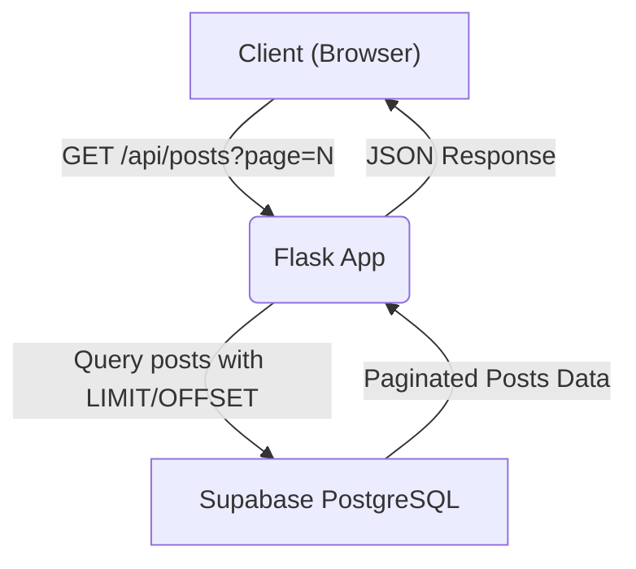
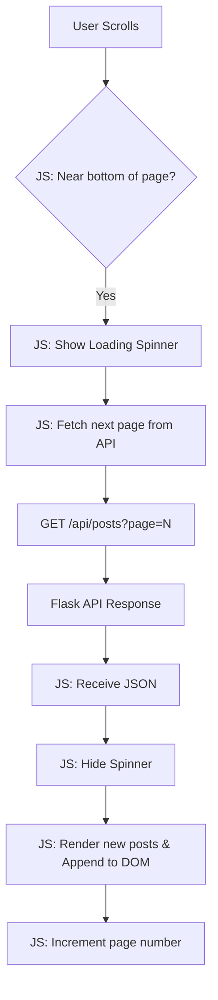

# Technical Plan: Implement Lazy Loading for Blog Posts

🌟 **Summary**

Optimize application performance by implementing server-side pagination and a client-side load-on-scroll mechanism for the blog post list.

---

📊 **High-Level Flow Diagrams**

### Backend Request Flow



### Frontend Interaction Flow



---

🧰 **Implementation Details**

## 1. Backend (`app.py`)

### a. Modify Index Route for Initial Page Load

The existing `index` route will be updated to fetch only the first page of posts. This reduces the initial data load.

**File:** `app.py`

```python
# app.py

POSTS_PER_PAGE = 10

@app.route('/')
def index():
    # Fetch only the first page for the initial load
    response = supabase.table('posts').select('*').order('timestamp', desc=True).limit(POSTS_PER_PAGE).execute()
    posts = response.data
    
    # We can pass the initial page number and total posts if needed for the frontend
    # For a simple infinite scroll, we just need the first batch of posts.
    return render_template('index.html', posts=posts)
```

### b. Create API Endpoint for Paginated Loading

A new route, `/api/posts`, will be created to serve subsequent pages of posts as JSON. This endpoint will accept a `page` query parameter.

**File:** `app.py`

```python
# app.py

from flask import jsonify, request

# ... (other imports and code)

POSTS_PER_PAGE = 10

# ... (index route) ...

@app.route('/api/posts')
def api_posts():
    try:
        page = int(request.args.get('page', 1))
    except (TypeError, ValueError):
        page = 1
        
    offset = (page - 1) * POSTS_PER_PAGE
    
    # Fetch posts for the requested page
    posts_response = supabase.table('posts').select('*').order('timestamp', desc=True).limit(POSTS_PER_PAGE).offset(offset).execute()
    posts_data = posts_response.data
    
    # To determine if there's a next page, we can try to fetch one more item than required
    # A more efficient way is to get a total count once, but this avoids a separate COUNT query.
    has_next_response = supabase.table('posts').select('id').limit(1).offset(offset + POSTS_PER_PAGE).execute()
    has_next = bool(has_next_response.data)

    return jsonify({
        'posts': posts_data,
        'has_next': has_next
    })

```

## 2. Frontend (`index.html` and `script.js`)

### a. Update HTML Structure

The `index.html` template needs a container for the posts with a unique ID for easy selection by JavaScript. We also need elements to act as a loading indicator and an end-of-posts message.

**File:** `templates/index.html`

```html
<!-- templates/index.html -->

...
<div class="posts-container" id="posts-container">
    
        <div class="post">
            <!-- Existing post structure -->
            <h2><a href="{{ url_for('view_post', post_id=post.id) }}">{{ post.title }}</a></h2>
            ...
        </div>
    
</div>

<div id="loading-indicator" style="display: none;">
    <p>Loading more posts...</p>
</div>

<div id="end-of-posts-message" style="display: none;">
    <p>You've reached the end.</p>
</div>
...
```

### b. Implement Client-Side JavaScript Logic

A script will be added to handle the scroll events, fetch data from the `/api/posts` endpoint, and inject the new posts into the DOM.

**File:** `static/js/script.js`

```javascript
// static/js/script.js

document.addEventListener('DOMContentLoaded', () => {
    const postsContainer = document.getElementById('posts-container');
    const loadingIndicator = document.getElementById('loading-indicator');
    const endOfPostsMessage = document.getElementById('end-of-posts-message');

    if (!postsContainer) return;

    let page = 2; // Start with page 2, since page 1 is loaded initially
    let isLoading = false;
    let hasNext = true;

    const loadMorePosts = async () => {
        if (isLoading || !hasNext) return;

        isLoading = true;
        loadingIndicator.style.display = 'block';

        try {
            const response = await fetch(`/api/posts?page=${page}`);
            if (!response.ok) {
                throw new Error(`HTTP error! status: ${response.status}`);
            }
            const data = await response.json();

            if (data.posts && data.posts.length > 0) {
                data.posts.forEach(post => {
                    const postElement = document.createElement('div');
                    postElement.classList.add('post');
                    // This HTML structure must match the one in index.html
                    postElement.innerHTML = `
                        <h2><a href="/post/${post.id}">${post.title}</a></h2>
                        <p class="post-meta">Posted on ${new Date(post.timestamp).toLocaleDateString()}</p>
                        ${post.image ? `` : ''}
                        <div class="post-content-preview">${post.content.substring(0, 200)}...</div>
                    `;
                    postsContainer.appendChild(postElement);
                });
                page++;
            }
            
            hasNext = data.has_next;
            if (!hasNext) {
                endOfPostsMessage.style.display = 'block';
            }

        } catch (error) {
            console.error("Failed to load more posts:", error);
            // Optionally, display an error message to the user
        } finally {
            isLoading = false;
            loadingIndicator.style.display = 'none';
        }
    };

    window.addEventListener('scroll', () => {
        // Load more posts when the user is 100px from the bottom
        if ((window.innerHeight + window.scrollY) >= document.body.offsetHeight - 100) {
            loadMorePosts();
        }
    });
});
```

---

📦 **Technical Summary**

-   **`app.py`**:
    -   Modify `index()` to fetch only the first page of posts (`LIMIT 10`).
    -   Add a new route `/api/posts` that accepts a `page` parameter.
    -   In `/api/posts`, use `limit` and `offset` in the Supabase query to fetch the correct slice of posts.
    -   The API will return JSON with `posts` and a `has_next` boolean.
-   **`templates/index.html`**:
    -   Add `id="posts-container"` to the main posts `div`.
    -   Add `div` elements for `id="loading-indicator"` and `id="end-of-posts-message"`.
-   **`static/js/script.js`**:
    -   Add a `scroll` event listener.
    -   Implement `loadMorePosts` function to `fetch` from `/api/posts`.
    -   Dynamically create post HTML elements from the JSON response and append them to the `#posts-container`.
    -   Manage state variables `page`, `isLoading`, and `hasNext` to control fetching.
    -   Show/hide the loading and end-of-posts indicators.
