# 🚀 Comprehensive Logging System Implementation Plan

> **Goal**: To establish a robust, centralized, and modular logging system across the Flask application, adhering to Python's best practices and "monotonic design principles." This ensures consistent, attributable, and configurable log data from all architectural layers (blueprints, services, repositories), facilitating enhanced debugging, monitoring, and operational insight.

---

## 🏗️ Architecture Visualization

### ✨ Monotonic Logging Architecture


---

## 📂 Project File Structure

```text
📦 Blog Root
 ┣ 📜 app.py                  # 🚀 Main Entry Point (Initializes Logging)
 ┣ 📜 config.py               # ⚙️ Configuration (Logging Settings)
 ┣ 📜 container.py            # 💉 Dependency Injection
 ┣ 📜 worker.py               # 👷 Background Worker (Not directly included in this logging plan)
 ┃
 ┣ 📂 blueprints/             # 🗺️ Route Definitions (Will use module-specific loggers)
 ┃ ┣ 📜 __init__.py
 ┃ ┣ 📜 auth.py
 ┃ ┣ 📜 blog.py
 ┃ ┣ 📜 admin.py
 ┃ ┗ 📜 api.py
 ┃
 ┣ 📂 services/               # 🧠 Business Logic (Will use module-specific loggers)
 ┃ ┣ 📜 __init__.py
 ┃ ┣ 📜 auth_service.py
 ┃ ┣ 📜 post_service.py
 ┃ ┣ 📜 video_service.py
 ┃ ┣ 📜 worker_service.py
 ┃ ┗ 📜 config_service.py
 ┃
 ┣ 📂 repositories/           # 💾 Data Access (Will use module-specific loggers)
 ┃ ┣ 📜 __init__.py
 ┃ ┣ 📜 post_repository.py
 ┃ ┣ 📜 user_repository.py
 ┃ ┗ 📜 video_repository.py
 ┃
 ┣ 📂 static/                 # 🎨 Static Assets
 ┃
 ┣ 📂 templates/              # 🖼️ HTML Views
 ┃
 ┣ 📂 utils/                  # 🛠️ Utility Functions
 ┃ ┗ 📜 logger.py             # 📝 Centralized Logging Utility
 ┃
 ┗ 📂 logs/                   # 📁 Application Log Files (Automatically created)
     ┣ 📜 app.log             # Main application log (current)
     ┗ 📜 app.log.1, ...      # Rotated log files
```

---

## 🛠️ Implementation Guide

### 0️⃣ Python Logging Best Practices

We will adhere to the following best practices:

*   **`logging.getLogger(__name__)`**: Each module will obtain its own logger using its name, creating a hierarchical logging structure. This allows for granular control and clear attribution.
*   **Centralized Configuration**: All logging setup will happen once in `app.py` via `utils/logger.py`.
*   **Configurable Levels**: Logging verbosity (`DEBUG`, `INFO`, `WARNING`, `ERROR`, `CRITICAL`) will be controlled via environment variables.
*   **Dual Output**: Logs will be directed to both the console (for immediate feedback) and rotating files (for persistence and history).
*   **Structured Formatting**: Consistent log message formats including timestamp, level, logger name, and message.
*   **Exception Handling**: All caught and unhandled exceptions will be logged with full tracebacks.
*   **Suppression of Chatty Libraries**: External libraries that produce excessive `INFO` or `DEBUG` level logs will have their logging level adjusted to `WARNING` or `ERROR` to prevent clutter.

---

## 💻 Complete Code Examples

### 1. Centralized Logging Configuration (`utils/logger.py`)

This new module will contain the `setup_logging` function, responsible for configuring the Python `logging` module.

**File:** `utils/logger.py`

```python
import logging
import os
from logging.handlers import RotatingFileHandler
from flask import Flask

def setup_logging(app: Flask = None, log_file: str = "app.log", level: int = logging.INFO):
    """
    Sets up the logging configuration for the application.

    This function configures both console and file logging. For Flask applications,
    it integrates with the app.logger instance. For other scripts or modules,
    it configures the root logger or a named logger (though this plan focuses on Flask app).

    Args:
        app: The Flask application instance (optional). If provided, app.logger is configured.
        log_file: The base name of the log file (e.g., "app.log").
        level: The minimum logging level to capture (e.g., logging.INFO, logging.DEBUG).
    """
    # Determine the logger to configure
    if app:
        # For Flask applications, configure its default logger
        target_logger = app.logger
    else:
        # If no Flask app, configure the root logger (less common for this project's plan)
        target_logger = logging.getLogger()

    target_logger.setLevel(level)

    # Clear existing handlers to prevent duplicate logs if setup_logging is called multiple times
    for handler in list(target_logger.handlers):
        target_logger.removeHandler(handler)

    # 1. Console Handler: Outputs logs to stderr (default for StreamHandler)
    console_handler = logging.StreamHandler()
    console_formatter = logging.Formatter(
        '[%(asctime)s] %(levelname)s in %(name)s: %(message)s'
    )
    console_handler.setFormatter(console_formatter)
    target_logger.addHandler(console_handler)

    # 2. File Handler: Outputs logs to a rotating file
    if log_file:
        log_dir = os.path.join(os.getcwd(), 'logs') # Logs directory in project root
        os.makedirs(log_dir, exist_ok=True)
        file_path = os.path.join(log_dir, log_file)

        # RotatingFileHandler: rotates log files after a certain size
        file_handler = RotatingFileHandler(
            file_path,
            maxBytes=1024 * 1024 * 10, # 10 MB per file
            backupCount=5,             # Keep up to 5 backup log files
            encoding='utf-8'
        )
        file_formatter = logging.Formatter(
            '%(asctime)s - %(name)s - %(levelname)s - %(message)s'
        )
        file_handler.setFormatter(file_formatter)
        target_logger.addHandler(file_handler)

    # Suppress verbose loggers from external libraries if not in DEBUG mode
    if level > logging.DEBUG:
        logging.getLogger('werkzeug').setLevel(logging.WARNING) # Flask's internal web server
        logging.getLogger('supabase').setLevel(logging.WARNING) # Supabase client library
        # Add other chatty libraries here as needed

    target_logger.info(f"Logging configured with level: {logging.getLevelName(level)}")
    if log_file:
        target_logger.info(f"Logs will also be written to: {file_path}")

    return target_logger

```

### 2. Configuration (`config.py`)

The `Config` class will be extended to include logging-specific settings, making them easily manageable via environment variables.

**File:** `config.py`

```python
import os
import logging # Import logging module to access logging levels

class Config:
    SECRET_KEY: str = os.getenv('SECRET_KEY', 'dev_key')
    SUPABASE_URL: str = os.getenv('SUPABASE_URL')
    SUPABASE_KEY: str = os.getenv('SUPABASE_KEY')
    BLOG_IMAGES_BUCKET: str = os.getenv('BLOG_IMAGES_BUCKET', 'blog_images')
    BLOG_VIDEOS_BUCKET: str = os.getenv('BLOG_VIDEOS_BUCKET', 'blog_videos')
    ADMIN_USERNAME: str = os.getenv('ADMIN_USERNAME')
    ADMIN_PASSWORD: str = os.getenv('ADMIN_PASSWORD')
    POSTS_PER_PAGE: int = 10

    # Logging Configuration
    # Default to INFO, but can be overridden by an environment variable LOG_LEVEL
    LOG_LEVEL: str = os.getenv('LOG_LEVEL', 'INFO').upper()
    # Default log file name, can be overridden by LOG_FILE
    LOG_FILE: str = os.getenv('LOG_FILE', 'app.log')

    @property
    def LOGGING_LEVEL(self) -> int:
        """Converts the LOG_LEVEL string to a logging module constant."""
        return getattr(logging, self.LOG_LEVEL, logging.INFO)

```

### 3. Main App Integration (`app.py`)

`app.py` will serve as the central point for initializing the logging system during application startup. It will use `setup_logging` to configure Flask's `app.logger` and ensure all subsequent loggers inherit this configuration.

**File:** `app.py`

```python
from flask import Flask
from config import Config
import blueprints
# Import setup_logging from the new utility module
from utils.logger import setup_logging 
import logging # Needed to access logging levels and get global logger

app = Flask(__name__)
app.config.from_object(Config)
app.secret_key = Config.SECRET_KEY

# Initialize Logging for the Flask app
# This call configures app.logger and returns it.
main_logger = setup_logging(app=app, log_file=Config.LOG_FILE, level=Config.LOGGING_LEVEL)

# Register Blueprints
app.register_blueprint(blueprints.auth_bp)
app.register_blueprint(blueprints.blog_bp)
app.register_blueprint(blueprints.admin_bp)
app.register_blueprint(blueprints.api_bp)

# Example: Logging within app.py after setup
main_logger.info("Flask application initialized and starting up...")
main_logger.debug(f"Application running with debug mode: {app.debug}")


# Basic error handler for demonstration, comprehensive error handling
# would typically involve more specific decorators or extensions.
@app.errorhandler(Exception)
def handle_exception(e):
    # Log unhandled exceptions with traceback
    main_logger.error(f"An unhandled exception occurred: {e}", exc_info=True)
    # Re-raise or return a generic error response
    return "Internal Server Error", 500


if __name__ == "__main__":
    app.run(host="0.0.0.0", port=8080, debug=True)
```

### 4. Module-Specific Logging (Monotonic Design Example)

In line with the monotonic design, every Python module will acquire its own logger instance using `logging.getLogger(__name__)`. This ensures that log messages are clearly attributed to their source module, which is invaluable for debugging and understanding application flow.

#### Example: `services/post_service.py`

```python
import logging # Import logging
from typing import List, Dict, Any, Optional
from repositories.post_repository import PostRepository
from services.config_service import ConfigService
from dateutil import parser

# Obtain a logger instance for this specific module
logger = logging.getLogger(__name__)

class PostService:
    def __init__(self, repo: PostRepository, config: ConfigService):
        self.repo = repo
        self.config = config
        logger.info("PostService initialized with PostRepository and ConfigService.")

    def get_recent_posts(self, page: int = 1) -> List[Dict[str, Any]]:
        logger.debug(f"Attempting to fetch recent posts for page: {page}")
        # Assuming POSTS_PER_PAGE is accessible via config_service or similar means
        limit = self.config.POSTS_PER_PAGE # Example: Get from config_service or hardcoded
        offset = (page - 1) * limit
        
        timestamp_field = self.config.get_timestamp_field()
        try:
            posts = self.repo.get_all(limit=limit, offset=offset, order_by=timestamp_field or 'id')
            logger.info(f"Successfully retrieved {len(posts)} posts for page {page}.")
            
            for post in posts:
                post['formatted_timestamp'] = self._format_date(post.get(timestamp_field))
                if post.get('video_id'):
                    logger.debug(f"Post ID {post.get('id')} has video_id {post['video_id']}.")
                    # self._fetch_video_data is a placeholder for actual video service call
                    post['video'] = self._fetch_video_data(post['video_id']) 
            
            return posts
        except Exception as e:
            logger.error(f"Error fetching recent posts for page {page}: {e}", exc_info=True)
            raise # Re-raise the exception after logging for upstream handling

    def get_post_by_id(self, post_id: int) -> Optional[Dict[str, Any]]:
        logger.debug(f"Request to retrieve post with ID: {post_id}")
        try:
            post = self.repo.get_by_id(post_id)
            if post:
                logger.info(f"Post with ID {post_id} found successfully.")
            else:
                logger.warning(f"Post with ID {post_id} not found in the repository.")
            return post
        except Exception as e:
            logger.error(f"Error retrieving post with ID {post_id}: {e}", exc_info=True)
            raise

    def create_post(self, title: str, content: str, image_url: str = None, video_id: int = None):
        logger.info(f"Initiating creation of a new post titled: '{title}'.")
        data = {
            'title': title,
            'content': content,
            'image': image_url,
            'video_id': video_id,
            'timestamp': self._get_current_timestamp()
        }
        try:
            new_post = self.repo.create(data)
            if new_post:
                logger.info(f"Post '{title}' created successfully with ID: {new_post.get('id')}.")
            else:
                logger.error(f"Post '{title}' could not be created; repository returned no data.")
            return new_post
        except Exception as e:
            logger.error(f"Failed to create post '{title}': {e}", exc_info=True)
            raise

    def update_post(self, post_id: int, form_data, files):
        logger.info(f"Attempting to update post with ID: {post_id}.")
        # (Simplified) Placeholder for actual update logic including file handling
        try:
            # Assume form_data needs processing before passing to repo
            processed_data = {k: v for k, v in form_data.items() if k in ['title', 'content']}
            if 'image' in files and files['image'].filename:
                # Logic to handle image upload and get URL
                image_url = "some_new_image_url.jpg" # Placeholder
                processed_data['image'] = image_url
            
            self.repo.update(post_id, processed_data)
            logger.info(f"Post {post_id} updated successfully.")
        except Exception as e:
            logger.error(f"Error updating post {post_id}: {e}", exc_info=True)
            raise

    def delete_post(self, post_id: int):
        logger.info(f"Request to delete post with ID: {post_id}.")
        try:
            self.repo.delete(post_id)
            logger.info(f"Post {post_id} deleted successfully.")
        except Exception as e:
            logger.error(f"Error deleting post {post_id}: {e}", exc_info=True)
            raise

    def _format_date(self, date_str: str) -> str:
        if not date_str:
            logger.debug("Attempted to format an empty date string.")
            return ""
        try:
            dt = parser.parse(date_str).replace(tzinfo=None)
            return dt.strftime("%Y-%m-%d %I:%M %p")
        except Exception as e:
            logger.warning(f"Could not parse date string '{date_str}': {e}. Returning original string.")
            return str(date_str)

    def _get_current_timestamp(self) -> str:
        from datetime import datetime
        import pytz
        local_tz = pytz.timezone("Asia/Karachi") # Assuming this timezone is appropriate
        timestamp = datetime.now(local_tz).strftime("%Y-%m-%d %H:%M:%S")
        logger.debug(f"Generated current timestamp: {timestamp}")
        return timestamp

    def _fetch_video_data(self, video_id: int) -> Optional[Dict[str, Any]]:
        # Placeholder for actual video service call
        logger.debug(f"Simulating fetching video data for video_id: {video_id}")
        return {"id": video_id, "filepath": "/path/to/video.m3u8", "status": "processed"}
```

#### Example: `repositories/post_repository.py`

```python
import logging # Import logging
from typing import List, Dict, Optional, Any
from supabase import Client

# Obtain a logger instance for this specific module
logger = logging.getLogger(__name__)

class PostRepository:
    def __init__(self, client: Client):
        self.client = client
        logger.info("PostRepository initialized with Supabase client.")

    def get_all(self, limit: int = 10, offset: int = 0, order_by: str = 'id') -> List[Dict[str, Any]]:
        logger.debug(f"Fetching posts from database with limit={limit}, offset={offset}, order_by='{order_by}'.")
        try:
            response = (
                self.client.table('posts')
                .select('*')
                .order(order_by, desc=True)
                .limit(limit)
                .offset(offset)
                .execute()
            )
            posts = response.data or []
            logger.debug(f"Retrieved {len(posts)} posts from Supabase.")
            return posts
        except Exception as e:
            logger.error(
                f"Failed to fetch posts from Supabase (limit={limit}, offset={offset}, order_by='{order_by}'): {e}", 
                exc_info=True
            )
            return []

    def get_by_id(self, post_id: int) -> Optional[Dict[str, Any]]:
        logger.debug(f"Querying database for post with ID: {post_id}.")
        try:
            # Using .single() implies an expectation of one or zero results.
            # Supabase client might raise an exception if no row is found with .single()
            response = self.client.table('posts').select('*').eq('id', post_id).single().execute()
            if response.data:
                logger.debug(f"Found post with ID {post_id} in database.")
                return response.data
            else:
                logger.debug(f"No post found with ID {post_id} using .single(). This might indicate an issue or expected absence.")
                return None
        except Exception as e:
            # Supabase's .single() raises an exception if no row matches. This is often
            # a "not found" scenario rather than a true error, but should be logged
            # for unusual cases. Check for specific Supabase/PostgREST error codes if available.
            error_message = str(e)
            if "PGRST" in error_message and "no rows found" in error_message.lower(): # Heuristic for "not found"
                logger.info(f"Post with ID {post_id} not found in the database.")
                return None
            else:
                logger.error(f"Error fetching post {post_id} from Supabase: {e}", exc_info=True)
                raise # Re-raise if it's a genuine database error

    def create(self, data: Dict[str, Any]) -> Optional[Dict[str, Any]]:
        logger.debug(f"Attempting to create a new post in database with data: {data.get('title')}.")
        try:
            response = self.client.table('posts').insert(data).execute()
            if response.data:
                created_id = response.data[0].get('id')
                logger.info(f"New post successfully created in Supabase with ID: {created_id}.")
                return response.data[0]
            else:
                logger.warning(f"Post creation in Supabase returned no data. Input data: {data.get('title')}.")
                return None
        except Exception as e:
            logger.error(f"Failed to create post in Supabase with data {data.get('title')}: {e}", exc_info=True)
            raise

    def update(self, post_id: int, data: Dict[str, Any]):
        logger.debug(f"Updating post {post_id} in database with data: {data}.")
        try:
            self.client.table('posts').update(data).eq('id', post_id).execute()
            logger.info(f"Post {post_id} successfully updated in Supabase.")
        except Exception as e:
            logger.error(f"Failed to update post {post_id} in Supabase with data {data}: {e}", exc_info=True)
            raise

    def delete(self, post_id: int):
        logger.debug(f"Deleting post {post_id} from database.")
        try:
            self.client.table('posts').delete().eq('id', post_id).execute()
            logger.info(f"Post {post_id} successfully deleted from Supabase.")
        except Exception as e:
            logger.error(f"Failed to delete post {post_id} from Supabase: {e}", exc_info=True)
            raise

```

---

## 🚦 Request Flow with Logging: "Get Posts"

```mermaid
sequenceDiagram
    participant 👤 Client
    participant 🌐 app.py
    participant 🗺️ blueprints/api.py
    participant 🧠 services/post_service.py
    participant 💾 repositories/post_repository.py
    participant 🗄️ Supabase DB

    👤 Client->>🌐 app.py: GET /api/posts
    🌐 app.py->>🌐 app.py: app.logger.info("Request received: /api/posts")
    🌐 app.py->>🗺️ blueprints/api.py: Call get_posts()
    🗺️ blueprints/api.py->>🗺️ blueprints/api.py: api_bp_logger.debug("API call to get posts")
    🗺️ blueprints/api.py->>🧠 services/post_service.py: post_service.get_recent_posts(page)
    🧠 services/post_service.py->>🧠 services/post_service.py: post_service_logger.debug("Fetching recent posts for page X")
    🧠 services/post_service.py->>💾 repositories/post_repository.py: post_repo.get_all(limit, offset, order_by)
    💾 repositories/post_repository.py->>💾 repositories/post_repository.py: post_repo_logger.debug("Querying DB for posts...")
    💾 repositories/post_repository.py->>🗄️ Supabase DB: SELECT * FROM posts ...
    🗄️ Supabase DB-->>💾 repositories/post_repository.py: [Raw Data]
    💾 repositories/post_repository.py->>💾 repositories/post_repository.py: post_repo_logger.debug("Retrieved Y posts from DB.")
    💾 repositories/post_repository.py-->>🧠 services/post_service.py: [Formatted Data]
    🧠 services/post_service.py->>🧠 services/post_service.py: post_service_logger.info("Successfully retrieved Y posts.")
    🧠 services/post_service.py-->>🗺️ blueprints/api.py: [Processed Data]
    🗺️ blueprints/api.py-->>🌐 app.py: [JSON Response]
    🌐 app.py-->>👤 Client: 200 OK (JSON)
    alt Error Occurs
        💾 repositories/post_repository.py->>💾 repositories/post_repository.py: post_repo_logger.error("DB Error: ...", exc_info=True)
        💾 repositories/post_repository.py--x🧠 services/post_service.py: Raise Exception
        🧠 services/post_service.py->>🧠 services/post_service.py: post_service_logger.error("Service Error: ...", exc_info=True)
        🧠 services/post_service.py--x🗺️ blueprints/api.py: Raise Exception
        🗺️ blueprints/api.py--x🌐 app.py: Raise Exception
        🌐 app.py->>🌐 app.py: app.logger.error("Unhandled exception...", exc_info=True)
        🌐 app.py-->>👤 Client: 500 Internal Server Error
    end
```



---

## ✅ Checklist for Logging Implementation

- [] **Create `utils` Directory**: If it doesn't exist, create `Blog/utils/`.
- [] **Create `utils/logger.py`**: Implement the `setup_logging` function as provided.
- [] **Update `config.py`**: Add `LOG_LEVEL` and `LOG_FILE` properties, ensuring environment variable support.
- [] **Update `app.py`**:
    - [] Import `setup_logging` from `utils.logger`.
    - [] Call `setup_logging(app=app, log_file=Config.LOG_FILE, level=Config.LOGGING_LEVEL)` early in the app initialization.
    - [] Add an example `app.logger.info()` and `app.logger.debug()` call.
    - [] Implement a general `app.errorhandler(Exception)` to catch and log unhandled exceptions with `exc_info=True`.
- [ ] **Integrate Logging in `blueprints/*.py`**:
    - [ ] Import `logging` at the top of each blueprint file.
    - [ ] Add `logger = logging.getLogger(__name__)` at the module level.
    - [ ] Replace `print()` statements and add appropriate `logger.info()`, `logger.debug()`, `logger.warning()`, and `logger.error(..., exc_info=True)` calls.
- [ ] **Integrate Logging in `services/*.py`**:
    - [ ] Import `logging` at the top of each service file.
    - [ ] Add `logger = logging.getLogger(__name__)` at the module level.
    - [ ] Replace `print()` statements and add appropriate `logger.info()`, `logger.debug()`, `logger.warning()`, and `logger.error(..., exc_info=True)` calls.
- [ ] **Integrate Logging in `repositories/*.py`**:
    - [ ] Import `logging` at the top of each repository file.
    - [ ] Add `logger = logging.getLogger(__name__)` at the module level.
    - [ ] Replace `print()` statements and add appropriate `logger.info()`, `logger.debug()`, `logger.warning()`, and `logger.error(..., exc_info=True)` calls. Also, refine error handling to log database-specific exceptions accurately.
- [ ] **Test Log Output**:
    - [ ] Run the application and verify console output.
    - [ ] Check for the creation of the `logs/app.log` file and its contents.
    - [ ] Verify log rotation works (requires generating enough logs to exceed size limit).
    - [ ] Confirm different log levels (e.g., `DEBUG` vs `INFO`) are respected based on `LOG_LEVEL` environment variable.
    - [ ] Induce an error to confirm exception logging with traceback.
- [ ] **Update `.gitignore`**: Add `/logs/` to prevent log files from being committed to version control.
