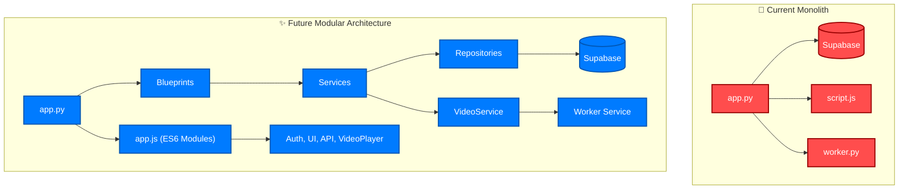
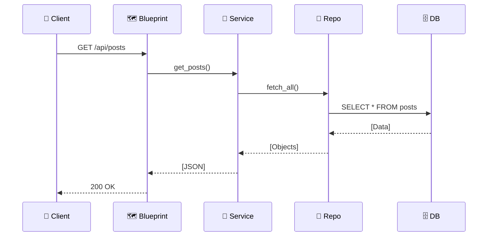

# 🚀 Massive Code Refactor & Modularization Plan

> **Goal**: Transform the current monolith into a sleek, modular, and scalable architecture.

---

## 🏗️ Architecture Visualization

### 🔄 The "Before" & "After"



---

```text
📦 Blog Root
 ┣ 📜 app.py                  # 🚀 Main Entry Point
 ┣ 📜 config.py               # ⚙️ Configuration
 ┣ 📜 container.py            # 💉 Dependency Injection (The Glue)
 ┣ 📜 worker.py               # 👷 Background Worker
 ┃
 ┣ 📂 blueprints/             # 🗺️ Route Definitions
 ┃ ┣ 📜 __init__.py
 ┃ ┣ 📜 auth.py               # 🔐 Login/Logout
 ┃ ┣ 📜 blog.py               # 🏠 Public Pages
 ┃ ┣ 📜 admin.py              # 🛠️ Admin Tools
 ┃ ┗ 📜 api.py                # 🔌 JSON API
 ┃
 ┣ 📂 services/               # 🧠 Business Logic
 ┃ ┣ 📜 __init__.py
 ┃ ┣ 📜 auth_service.py
 ┃ ┣ 📜 post_service.py
 ┃ ┣ 📜 video_service.py
 ┃ ┣ 📜 worker_service.py
 ┃ ┗ 📜 config_service.py
 ┃
 ┣ 📂 repositories/           # 💾 Data Access
 ┃ ┣ 📜 __init__.py
 ┃ ┣ 📜 post_repository.py
 ┃ ┣ 📜 user_repository.py
 ┃ ┗ 📜 video_repository.py
 ┃
 ┣ 📂 static/
 ┃ ┗ 📂 js/
 ┃   ┣ 📜 app.js              # ⚡ Main Frontend Entry
 ┃   ┗ 📂 modules/            # 🧩 ES6 Modules
 ┃     ┣ 📜 api.js
 ┃     ┣ 📜 auth.js
 ┃     ┣ 📜 ui.js
 ┃     ┗ 📜 video_player.js
 ┃
 ┗ 📂 templates/              # 🎨 HTML Views
```

---

## 🛠️ Implementation Guide

### 0️⃣ Type Safety First 🛡️

We will strictly use **Type Hints** throughout the codebase to ensure robustness and better IDE support.

- **Python**: Use `typing` (e.g., `List`, `Dict`, `Optional`) and Pydantic models where appropriate.
- **JavaScript**: Use JSDoc comments for function signatures.

### 1️⃣ Backend: The Core

#### **A. Configuration (`config.py`)**

Centralize your secrets and settings. No more magic strings!

```python
class Config:
    SECRET_KEY: str = os.getenv('SECRET_KEY', 'dev_key')
    SUPABASE_URL: str = os.getenv('SUPABASE_URL')
    # ...
```

#### **B. The Glue (`container.py`)**

Connect your components here. This keeps `app.py` clean and beautiful.

```python
# container.py
from supabase import Client

# 1. Init Client
supabase_client: Client = create_client(Config.SUPABASE_URL, Config.SUPABASE_KEY)

# 2. Init Repos
post_repo: PostRepository = PostRepository(supabase_client)

# 3. Init Services
post_service: PostService = PostService(post_repo)
```

#### **C. Blueprints (`blueprints/blog.py`)**

Routes just handle requests. Logic lives in Services.

```python
@blog_bp.route('/')
def home() -> str:
    posts: list[dict] = post_service.get_recent_posts() # Clean! ✨
    return render_template('index.html', posts=posts)
```

### 2️⃣ Frontend: Modern & Modular

#### **A. ES6 Modules**

Say goodbye to `script.js` spaghetti.

- **`api.js`**: Handle all `fetch` calls.
- **`ui.js`**: Toasts, Modals, DOM manipulation.
- **`video_player.js`**: A proper Class for the player.

#### **B. Entry Point (`app.js`)**

```javascript
import { fetchPosts } from "./modules/api.js";
// ...
```

---

---

## 💻 Deep Dive: Code Examples

### 💾 Repository Layer (`repositories/post_repository.py`)

```python
from typing import List, Dict, Optional, Any
from supabase import Client

class PostRepository:
    def __init__(self, client: Client):
        self.client = client

    def get_all(self, limit: int = 10, offset: int = 0, order_by: str = 'id') -> List[Dict[str, Any]]:
        try:
            response = (
                self.client.table('posts')
                .select('*')
                .order(order_by, desc=True)
                .limit(limit)
                .offset(offset)
                .execute()
            )
            return response.data or []
        except Exception as e:
            print(f"Error fetching posts: {e}")
            return []

    def create(self, data: Dict[str, Any]) -> Optional[Dict[str, Any]]:
        try:
            response = self.client.table('posts').insert(data).execute()
            return response.data[0] if response.data else None
        except Exception as e:
            print(f"Error creating post: {e}")
            return None
```

### 🧠 Service Layer (`services/post_service.py`)

```python
from typing import List, Dict, Any
from repositories.post_repository import PostRepository
from services.config_service import ConfigService

class PostService:
    def __init__(self, repo: PostRepository, config: ConfigService):
        self.repo = repo
        self.config = config

    def get_recent_posts(self, page: int = 1) -> List[Dict[str, Any]]:
        limit = 10
        offset = (page - 1) * limit

        # Dynamic timestamp resolution
        timestamp_field = self.config.get_timestamp_field()

        posts = self.repo.get_all(limit=limit, offset=offset, order_by=timestamp_field or 'id')

        # Business Logic: Format timestamps
        for post in posts:
            post['formatted_date'] = self._format_date(post.get(timestamp_field))

        return posts

    def _format_date(self, date_str: str) -> str:
        # ... date formatting logic ...
        return date_str
```

### 👷 Worker Service (`services/worker_service.py`)

```python
from typing import Optional
from werkzeug.datastructures import FileStorage

class WorkerService:
    def __init__(self, supabase_client, video_bucket: str):
        self.client = supabase_client
        self.bucket = video_bucket

    def handle_upload(self, file: FileStorage) -> Optional[str]:
        """Uploads file and returns the file_id."""
        # 1. Upload to Storage
        # 2. Insert into 'videos' table
        # 3. Queue for processing
        return "video_id_123"
```

### 🎬 Frontend (`static/js/modules/video_player.js`)

```javascript
/**
 * Handles video playback logic.
 */
export class VideoPlayer {
  /**
   * @param {HTMLElement} container
   */
  constructor(container) {
    this.container = container;
    this.videoEl = container.querySelector("video");
    this.init();
  }

  init() {
    this.videoEl.addEventListener("play", () => this.onPlay());
    // ... more listeners
  }

  onPlay() {
    console.log("Video started!");
    this.container.classList.add("playing");
  }
}
```

---

## 🚦 Request Flow: "Get Posts"



---

## ✅ Checklist

- [ ] **Scaffold**: Create directories (`blueprints`, `services`, `repositories`).
- [ ] **Backend**: Move logic from `app.py` to Services/Repos.
- [ ] **Wiring**: Create `container.py` and link it up.
- [ ] **Frontend**: Split `script.js` into Modules.
- [ ] **Verify**: Test all flows (Login, Post, Video).

---
