# 🚀 Massive Code Refactor & Modularization Plan

> **Goal**: Transform the current monolith into a sleek, modular, and scalable architecture.

---

## 🏗️ Architecture Visualization

### 🔄 The "Before" & "After"


---

## 📂 Project File Structure

```text
📦 Blog Root
 ┣ 📜 app.py                  # 🚀 Main Entry Point
 ┣ 📜 config.py               # ⚙️ Configuration
 ┣ 📜 container.py            # 💉 Dependency Injection (The Glue)
 ┣ 📜 worker.py               # 👷 Background Worker
 ┃
 ┣ 📂 blueprints/             # 🗺️ Route Definitions
 ┃ ┣ 📜 __init__.py
 ┃ ┣ 📜 auth.py               # 🔐 Login/Logout
 ┃ ┣ 📜 blog.py               # 🏠 Public Pages
 ┃ ┣ 📜 admin.py              # 🛠️ Admin Tools
 ┃ ┗ 📜 api.py                # 🔌 JSON API
 ┃
 ┣ 📂 services/               # 🧠 Business Logic
 ┃ ┣ 📜 __init__.py
 ┃ ┣ 📜 auth_service.py
 ┃ ┣ 📜 post_service.py
 ┃ ┣ 📜 video_service.py
 ┃ ┣ 📜 worker_service.py
 ┃ ┗ 📜 config_service.py
 ┃
 ┣ 📂 repositories/           # 💾 Data Access
 ┃ ┣ 📜 __init__.py
 ┃ ┣ 📜 post_repository.py
 ┃ ┣ 📜 user_repository.py
 ┃ ┗ 📜 video_repository.py
 ┃
 ┣ 📂 static/
 ┃ ┗ 📂 js/
 ┃   ┣ 📜 app.js              # ⚡ Main Frontend Entry
 ┃   ┗ 📂 modules/            # 🧩 ES6 Modules
 ┃     ┣ 📜 api.js
 ┃     ┣ 📜 auth.js
 ┃     ┣ 📜 ui.js
 ┃     ┗ 📜 video_player.js
 ┃
 ┗ 📂 templates/              # 🎨 HTML Views
```

---

## 🛠️ Implementation Guide

### 0️⃣ Type Safety First 🛡️

We will strictly use **Type Hints** throughout the codebase to ensure robustness and better IDE support.

- **Python**: Use `typing` (e.g., `List`, `Dict`, `Optional`) and Pydantic models where appropriate.
- **JavaScript**: Use JSDoc comments for function signatures.

---

## 💻 Complete Code Examples

### ⚙️ Configuration (`config.py`)

```python
import os

class Config:
    SECRET_KEY: str = os.getenv('SECRET_KEY', 'dev_key')
    SUPABASE_URL: str = os.getenv('SUPABASE_URL')
    SUPABASE_KEY: str = os.getenv('SUPABASE_KEY')
    BLOG_IMAGES_BUCKET: str = os.getenv('BLOG_IMAGES_BUCKET', 'blog_images')
    BLOG_VIDEOS_BUCKET: str = os.getenv('BLOG_VIDEOS_BUCKET', 'blog_videos')
    ADMIN_USERNAME: str = os.getenv('ADMIN_USERNAME')
    ADMIN_PASSWORD: str = os.getenv('ADMIN_PASSWORD')
    POSTS_PER_PAGE: int = 10
```

### 💉 Container (`container.py`)

```python
from supabase import create_client, Client
from config import Config

# Repositories
from repositories.post_repository import PostRepository
from repositories.user_repository import UserRepository
from repositories.video_repository import VideoRepository

# Services
from services.auth_service import AuthService
from services.post_service import PostService
from services.video_service import VideoService
from services.worker_service import WorkerService
from services.config_service import ConfigService

# Initialize Supabase Client
supabase_client: Client = create_client(Config.SUPABASE_URL, Config.SUPABASE_KEY)

# Initialize Repositories
post_repo: PostRepository = PostRepository(supabase_client)
user_repo: UserRepository = UserRepository(supabase_client)
video_repo: VideoRepository = VideoRepository(supabase_client)

# Initialize Services
config_service: ConfigService = ConfigService(supabase_client)
auth_service: AuthService = AuthService(user_repo)
post_service: PostService = PostService(post_repo, config_service)
worker_service: WorkerService = WorkerService(supabase_client, Config.BLOG_VIDEOS_BUCKET)
video_service: VideoService = VideoService(video_repo, worker_service)
```

### 🚀 Main App (`app.py`)

```python
from flask import Flask
from config import Config
import blueprints

app = Flask(__name__)
app.config.from_object(Config)
app.secret_key = Config.SECRET_KEY

# Register Blueprints
app.register_blueprint(blueprints.auth_bp)
app.register_blueprint(blueprints.blog_bp)
app.register_blueprint(blueprints.admin_bp)
app.register_blueprint(blueprints.api_bp)

if __name__ == "__main__":
    app.run(host="0.0.0.0", port=8080, debug=True)
```

### 👷 Worker Entry (`worker.py`)

```python
import time
from container import worker_service

if __name__ == "__main__":
    print("🚀 Worker started...")
    # Polling or Job Queue logic here
    while True:
        time.sleep(10)
```

---

## 📦 Package Initialization

**`blueprints/__init__.py`**
```python
from .auth import auth_bp
from .blog import blog_bp
from .admin import admin_bp
from .api import api_bp
```

**`services/__init__.py`**
```python
from .auth_service import AuthService
from .post_service import PostService
from .video_service import VideoService
from .worker_service import WorkerService
from .config_service import ConfigService
```

**`repositories/__init__.py`**
```python
from .post_repository import PostRepository
from .user_repository import UserRepository
from .video_repository import VideoRepository
```

---

## 🗺️ Blueprints (Routes)

### 🔐 Auth Blueprint (`blueprints/auth.py`)

```python
from flask import Blueprint, request, jsonify, render_template, redirect, url_for, session
from container import auth_service

auth_bp = Blueprint('auth', __name__)

@auth_bp.route('/login', methods=['GET', 'POST'])
def login():
    if request.method == 'POST':
        username = request.form['username']
        password = request.form['password']
        remember = request.form.get('remember')
        
        if auth_service.authenticate(username, password):
            session['admin'] = True
            
            if remember:
                response = redirect(url_for('blog.home'))
                token = auth_service.create_persistent_token('admin')
                response.set_cookie('remember_me', token, max_age=30*24*60*60)
                return response
                
            return redirect(url_for('blog.home'))
        else:
            return render_template('login.html', error='Invalid credentials')
    
    return render_template('login.html')

@auth_bp.route('/logout')
def logout():
    token = request.cookies.get('remember_me')
    if token:
        auth_service.revoke_token(token)
    
    session.pop('admin', None)
    response = redirect(url_for('blog.home'))
    response.delete_cookie('remember_me')
    return response

@auth_bp.route('/check_session')
def check_session():
    return jsonify({'admin': session.get('admin', False)})

@auth_bp.route('/set_session', methods=['POST'])
def set_session():
    data = request.get_json()
    session['admin'] = data.get('admin', False)
    return jsonify({'message': 'Session updated'})
```

### 🏠 Blog Blueprint (`blueprints/blog.py`)

```python
from flask import Blueprint, render_template, request
from container import post_service

blog_bp = Blueprint('blog', __name__)

@blog_bp.route('/')
def home():
    posts = post_service.get_recent_posts(page=1)
    return render_template('index.html', posts=posts, admin=session.get('admin', False))

@blog_bp.route('/filter')
def filter_posts():
    year = request.args.get('year', 'any')
    month = request.args.get('month', 'any')
    day = request.args.get('day', 'any')
    
    posts = post_service.filter_posts(year, month, day)
    return render_template('index.html', posts=posts)

@blog_bp.route('/post/<int:post_id>')
def view_post(post_id: int):
    post = post_service.get_post_by_id(post_id)
    return render_template('post.html', post=post)
```

### 🛠️ Admin Blueprint (`blueprints/admin.py`)

```python
from flask import Blueprint, render_template, request, redirect, url_for, session, flash
from container import post_service, video_service

admin_bp = Blueprint('admin', __name__)

def admin_required(f):
    def wrapper(*args, **kwargs):
        if not session.get('admin'):
            return redirect(url_for('auth.login'))
        return f(*args, **kwargs)
    wrapper.__name__ = f.__name__
    return wrapper

@admin_bp.route('/new', methods=['GET', 'POST'])
@admin_required
def new_post():
    if request.method == 'POST':
        title = request.form['title']
        content = request.form['content']
        
        image_url = None
        if 'image' in request.files:
            image_url = post_service.handle_image_upload(request.files['image'])
        
        video_id = None
        if 'video' in request.files:
            video_id = video_service.upload_video(request.files['video'])
        
        post_service.create_post(title, content, image_url, video_id)
        flash('Post created successfully!', 'success')
        return redirect(url_for('blog.home'))
    
    return render_template('new.html')

@admin_bp.route('/edit/<int:post_id>', methods=['GET', 'POST'])
@admin_required
def edit_post(post_id: int):
    if request.method == 'POST':
        post_service.update_post(post_id, request.form, request.files)
        flash('Post updated!', 'success')
        return redirect(url_for('blog.home'))
    
    post = post_service.get_post_by_id(post_id)
    return render_template('edit.html', post=post)

@admin_bp.route('/delete/<int:post_id>')
@admin_required
def delete_post(post_id: int):
    post_service.delete_post(post_id)
    flash('Post deleted!', 'success')
    return redirect(url_for('blog.home'))
```

### 🔌 API Blueprint (`blueprints/api.py`)

```python
from flask import Blueprint, request, jsonify
from container import post_service, auth_service

api_bp = Blueprint('api', __name__, url_prefix='/api')

@api_bp.route('/posts')
def get_posts():
    page = request.args.get('page', 1, type=int)
    posts = post_service.get_recent_posts(page)
    has_next = post_service.has_next_page(page)
    
    return jsonify({
        'posts': posts,
        'has_next': has_next
    })

@api_bp.route('/check_admin')
def check_admin():
    return jsonify({'is_admin': session.get('admin', False)})
```

---

## 🧠 Services (Business Logic)

### 📝 Post Service (`services/post_service.py`)

```python
from typing import List, Dict, Any, Optional
from repositories.post_repository import PostRepository
from services.config_service import ConfigService
from dateutil import parser

class PostService:
    def __init__(self, repo: PostRepository, config: ConfigService):
        self.repo = repo
        self.config = config

    def get_recent_posts(self, page: int = 1) -> List[Dict[str, Any]]:
        limit = 10
        offset = (page - 1) * limit
        
        timestamp_field = self.config.get_timestamp_field()
        posts = self.repo.get_all(limit=limit, offset=offset, order_by=timestamp_field or 'id')
        
        for post in posts:
            post['formatted_timestamp'] = self._format_date(post.get(timestamp_field))
            if post.get('video_id'):
                post['video'] = self._fetch_video_data(post['video_id'])
        
        return posts

    def get_post_by_id(self, post_id: int) -> Optional[Dict[str, Any]]:
        return self.repo.get_by_id(post_id)

    def create_post(self, title: str, content: str, image_url: str = None, video_id: int = None):
        data = {
            'title': title,
            'content': content,
            'image': image_url,
            'video_id': video_id,
            'timestamp': self._get_current_timestamp()
        }
        return self.repo.create(data)

    def update_post(self, post_id: int, form_data, files):
        # Business logic for updating
        pass

    def delete_post(self, post_id: int):
        self.repo.delete(post_id)

    def _format_date(self, date_str: str) -> str:
        if not date_str:
            return ""
        try:
            dt = parser.parse(date_str).replace(tzinfo=None)
            return dt.strftime("%Y-%m-%d %I:%M %p")
        except:
            return str(date_str)

    def _get_current_timestamp(self) -> str:
        from datetime import datetime
        import pytz
        local_tz = pytz.timezone("Asia/Karachi")
        return datetime.now(local_tz).strftime("%Y-%m-%d %H:%M:%S")
```

### 🔐 Auth Service (`services/auth_service.py`)

```python
from typing import Optional
from repositories.user_repository import UserRepository
import hashlib
import uuid
from datetime import datetime, timedelta
import pytz

class AuthService:
    def __init__(self, user_repo: UserRepository):
        self.repo = user_repo

    def authenticate(self, username: str, password: str) -> bool:
        from config import Config
        return username == Config.ADMIN_USERNAME and password == Config.ADMIN_PASSWORD

    def create_persistent_token(self, user_id: str) -> str:
        token = str(uuid.uuid4())
        hashed_token = hashlib.sha256(token.encode()).hexdigest()
        expires_at = datetime.now(pytz.utc) + timedelta(days=30)
        
        self.repo.create_persistent_login(user_id, hashed_token, expires_at.isoformat())
        return token

    def check_token(self, token: str) -> bool:
        if not token:
            return False
        
        hashed_token = hashlib.sha256(token.encode()).hexdigest()
        login = self.repo.get_persistent_login(hashed_token)
        
        if not login:
            return False
        
        expires_at = datetime.fromisoformat(login['expires_at'])
        return expires_at > datetime.now(pytz.utc)

    def revoke_token(self, token: str):
        hashed_token = hashlib.sha256(token.encode()).hexdigest()
        self.repo.delete_persistent_login(hashed_token)
```

### 🎬 Video Service (`services/video_service.py`)

```python
from typing import Optional
from werkzeug.datastructures import FileStorage
from repositories.video_repository import VideoRepository
from services.worker_service import WorkerService

class VideoService:
    def __init__(self, video_repo: VideoRepository, worker_service: WorkerService):
        self.repo = video_repo
        self.worker = worker_service

    def upload_video(self, file: FileStorage) -> Optional[int]:
        # 1. Save file via worker
        result = self.worker.save_file(file)
        file_id = result.get('file_id')
        
        # 2. Queue for processing
        if file_id:
            self.worker.queue_file(file_id)
        
        return file_id
```

### 👷 Worker Service (`services/worker_service.py`)

```python
from typing import Optional, Dict, Any
from werkzeug.datastructures import FileStorage
import uuid

class WorkerService:
    def __init__(self, supabase_client, video_bucket: str):
        self.client = supabase_client
        self.bucket = video_bucket

    def save_file(self, file: FileStorage) -> Dict[str, Any]:
        filename = uuid.uuid4().hex + "." + file.filename.split(".")[-1]
        filepath = f"{self.client.supabase_url}/storage/v1/object/public/{self.bucket}/upload/{filename}"
        
        # Upload to storage
        self.client.storage.from_(self.bucket).upload(
            f"upload/{filename}",
            file.read(),
            {"content-type": file.content_type}
        )
        
        # Insert record
        self.client.table("videos").insert({
            "filename": filename,
            "filepath": filepath
        }).execute()
        
        # Get ID
        response = self.client.table("videos").select("id").eq("filepath", filepath).execute()
        file_id = response.data[0]["id"] if response.data else None
        
        return {
            "message": "File uploaded successfully",
            "filename": filename,
            "file_id": file_id
        }

    def queue_file(self, file_id: int):
        # Queue for async processing (using APScheduler in real implementation)
        print(f"Queued file {file_id} for processing")
```

### ⚙️ Config Service (`services/config_service.py`)

```python
from typing import Optional

class ConfigService:
    _timestamp_field: Optional[str] = None

    def __init__(self, supabase_client):
        self.client = supabase_client

    def get_timestamp_field(self) -> str:
        if self._timestamp_field:
            return self._timestamp_field
        
        candidates = ("timestamp", "created_at", "published_at", "posted_at")
        
        try:
            resp = self.client.table("posts").select("*").limit(1).execute()
            if resp.data:
                keys = set(resp.data[0].keys())
                for c in candidates:
                    if c in keys:
                        self._timestamp_field = c
                        return c
        except:
            pass
        
        self._timestamp_field = "timestamp"
        return "timestamp"
```

---

## 💾 Repositories (Data Access)

### 📝 Post Repository (`repositories/post_repository.py`)

```python
from typing import List, Dict, Optional, Any
from supabase import Client

class PostRepository:
    def __init__(self, client: Client):
        self.client = client

    def get_all(self, limit: int = 10, offset: int = 0, order_by: str = 'id') -> List[Dict[str, Any]]:
        try:
            response = (
                self.client.table('posts')
                .select('*')
                .order(order_by, desc=True)
                .limit(limit)
                .offset(offset)
                .execute()
            )
            return response.data or []
        except Exception as e:
            print(f"Error fetching posts: {e}")
            return []

    def get_by_id(self, post_id: int) -> Optional[Dict[str, Any]]:
        try:
            response = self.client.table('posts').select('*').eq('id', post_id).single().execute()
            return response.data
        except:
            return None

    def create(self, data: Dict[str, Any]) -> Optional[Dict[str, Any]]:
        try:
            response = self.client.table('posts').insert(data).execute()
            return response.data[0] if response.data else None
        except Exception as e:
            print(f"Error creating post: {e}")
            return None

    def update(self, post_id: int, data: Dict[str, Any]):
        self.client.table('posts').update(data).eq('id', post_id).execute()

    def delete(self, post_id: int):
        self.client.table('posts').delete().eq('id', post_id).execute()
```

### 👤 User Repository (`repositories/user_repository.py`)

```python
from typing import Optional, Dict, Any
from supabase import Client

class UserRepository:
    def __init__(self, client: Client):
        self.client = client

    def get_persistent_login(self, token: str) -> Optional[Dict[str, Any]]:
        try:
            response = self.client.table('persistent_logins').select('*').eq('token', token).execute()
            return response.data[0] if response.data else None
        except:
            return None

    def create_persistent_login(self, user_id: str, token: str, expires_at: str):
        self.client.table('persistent_logins').insert({
            'user_id': user_id,
            'token': token,
            'expires_at': expires_at
        }).execute()

    def delete_persistent_login(self, token: str):
        self.client.table('persistent_logins').delete().eq('token', token).execute()
```

### 🎬 Video Repository (`repositories/video_repository.py`)

```python
from typing import Dict, Any, Optional
from supabase import Client

class VideoRepository:
    def __init__(self, client: Client):
        self.client = client

    def get_by_id(self, video_id: int) -> Optional[Dict[str, Any]]:
        try:
            response = self.client.table('videos').select('*').eq('id', video_id).single().execute()
            return response.data
        except:
            return None

    def create(self, filename: str, filepath: str, status: str = "processing") -> Dict[str, Any]:
        data = {"filename": filename, "filepath": filepath, "status": status}
        response = self.client.table('videos').insert(data).execute()
        return response.data[0]

    def update_status(self, video_id: int, status: str, filepath: str = None):
        data = {"status": status}
        if filepath:
            data["filepath"] = filepath
        self.client.table('videos').update(data).eq('id', video_id).execute()
```

---

## 🎨 Frontend (ES6 Modules)

### ⚡ Main Entry (`static/js/app.js`)

```javascript
import { fetchPosts } from './modules/api.js';
import { checkSession, initAuthListeners } from './modules/auth.js';
import { initToastHandlers } from './modules/ui.js';
import { VideoPlayer } from './modules/video_player.js';

document.addEventListener('DOMContentLoaded', async () => {
    // Check admin status
    const isAdmin = await checkSession();
    console.log("Admin:", isAdmin);
    
    // Initialize modules
    initAuthListeners();
    initToastHandlers();
    
    // Initialize all video players
    document.querySelectorAll('.video-container').forEach(container => {
        new VideoPlayer(container);
    });
});
```

### 🔌 API Module (`static/js/modules/api.js`)

```javascript
/**
 * Fetches posts from the API.
 * @param {number} page 
 * @returns {Promise<Object>}
 */
export async function fetchPosts(page) {
    const response = await fetch(`/api/posts?page=${page}`);
    if (!response.ok) {
        throw new Error(`HTTP error! status: ${response.status}`);
    }
    return response.json();
}

/**
 * Checks if the current user is an admin.
 * @returns {Promise<boolean>}
 */
export async function checkAdminStatus() {
    try {
        const response = await fetch('/api/check_admin');
        const data = await response.json();
        return data.is_admin;
    } catch {
        return false;
    }
}
```

### 🔐 Auth Module (`static/js/modules/auth.js`)

```javascript
/**
 * Checks if the user has an active session.
 * @returns {Promise<boolean>}
 */
export async function checkSession() {
    try {
        const response = await fetch('/check_session');
        const data = await response.json();
        return data.admin;
    } catch {
        return false;
    }
}

/**
 * Sets the admin session state.
 * @param {boolean} isAdmin 
 */
export async function setSession(isAdmin) {
    await fetch('/set_session', {
        method: 'POST',
        headers: { 'Content-Type': 'application/json' },
        body: JSON.stringify({ admin: isAdmin })
    });
}

/**
 * Initializes auth-related event listeners.
 */
export function initAuthListeners() {
    // Add event listeners for login/logout buttons
    console.log("Auth listeners initialized");
}
```

### 🎨 UI Module (`static/js/modules/ui.js`)

```javascript
/**
 * Shows a toast notification.
 * @param {string} message 
 * @param {string} type - 'success', 'error', 'info'
 */
export function showToast(message, type = 'info') {
    const toast = document.createElement('div');
    toast.className = `toast toast-${type}`;
    toast.textContent = message;
    document.body.appendChild(toast);
    
    setTimeout(() => toast.remove(), 4000);
}

/**
 * Initializes toast handlers.
 */
export function initToastHandlers() {
    const toasts = document.querySelectorAll('.toast');
    toasts.forEach(toast => {
        toast.style.opacity = '1';
        setTimeout(() => toast.remove(), 4000);
    });
}

/**
 * Toggles the filter panel.
 */
export function toggleFilter() {
    const panel = document.getElementById('filterPanel');
    const btn = document.getElementById('toggleFilterBtn');
    
    if (panel.classList.contains('open')) {
        panel.classList.remove('open');
        btn.textContent = 'Show Filter Options';
    } else {
        panel.classList.add('open');
        btn.textContent = 'Hide Filter Options';
    }
}
```

### 🎬 Video Player Module (`static/js/modules/video_player.js`)

```javascript
/**
 * Video player with HLS support.
 */
export class VideoPlayer {
    /**
     * @param {HTMLElement} container 
     */
    constructor(container) {
        this.container = container;
        this.videoEl = container.querySelector('.video-player');
        this.hlsInstance = null;
        
        this.initControls();
        this.initVideo();
    }

    initControls() {
        this.playBtn = this.container.querySelector('.play-pause-btn');
        this.progressBar = this.container.querySelector('.progress-bar');
        this.volumeSlider = this.container.querySelector('.volume-slider');
        this.fullscreenBtn = this.container.querySelector('.fullscreen-btn');
        
        this.playBtn.addEventListener('click', () => this.togglePlay());
        this.progressBar.addEventListener('input', () => this.seek());
        this.volumeSlider.addEventListener('input', () => this.changeVolume());
        this.fullscreenBtn.addEventListener('click', () => this.toggleFullscreen());
    }

    initVideo() {
        const url = this.videoEl.dataset.url;
        const status = this.videoEl.dataset.status;
        
        if (url && status === 'processed') {
            if (typeof Hls !== 'undefined' && Hls.isSupported()) {
                this.hlsInstance = new Hls();
                this.hlsInstance.loadSource(url);
                this.hlsInstance.attachMedia(this.videoEl);
            } else if (this.videoEl.canPlayType('application/vnd.apple.mpegurl')) {
                this.videoEl.src = url;
            }
        }
    }

    togglePlay() {
        if (this.videoEl.paused) {
            this.videoEl.play();
        } else {
            this.videoEl.pause();
        }
    }

    seek() {
        const seekTime = (this.progressBar.value / 100) * this.videoEl.duration;
        this.videoEl.currentTime = seekTime;
    }

    changeVolume() {
        this.videoEl.volume = this.volumeSlider.value / 100;
    }

    toggleFullscreen() {
        if (!document.fullscreenElement) {
            this.container.requestFullscreen();
        } else {
            document.exitFullscreen();
        }
    }
}
```

---

## 🚦 Request Flow: "Get Posts"

```mermaid
sequenceDiagram
    participant 👤 Client
    participant 🗺️ Blueprint
    participant 🧠 Service
    participant 💾 Repo
    participant 🗄️ DB

    👤 Client->>🗺️ Blueprint: GET /api/posts
    🗺️ Blueprint->>🧠 Service: get_posts()
    🧠 Service->>💾 Repo: fetch_all()
    💾 Repo->>🗄️ DB: SELECT * FROM posts
    🗄️ DB-->>💾 Repo: [Data]
    💾 Repo-->>🧠 Service: [Objects]
    🧠 Service-->>🗺️ Blueprint: [JSON]
    🗺️ Blueprint-->>👤 Client: 200 OK
```



---

## ✅ Checklist

- [ ] **Scaffold**: Create directories (`blueprints`, `services`, `repositories`).
- [ ] **Config**: Create `config.py` and `container.py`.
- [ ] **Repositories**: Implement all Repository classes.
- [ ] **Services**: Implement all Service classes.
- [ ] **Blueprints**: Create all Blueprint modules.
- [ ] **Frontend**: Split `script.js` into ES6 Modules.
- [ ] **Wiring**: Wire everything in `container.py`.
- [ ] **Verify**: Test all flows (Login, Post, Video).

---
